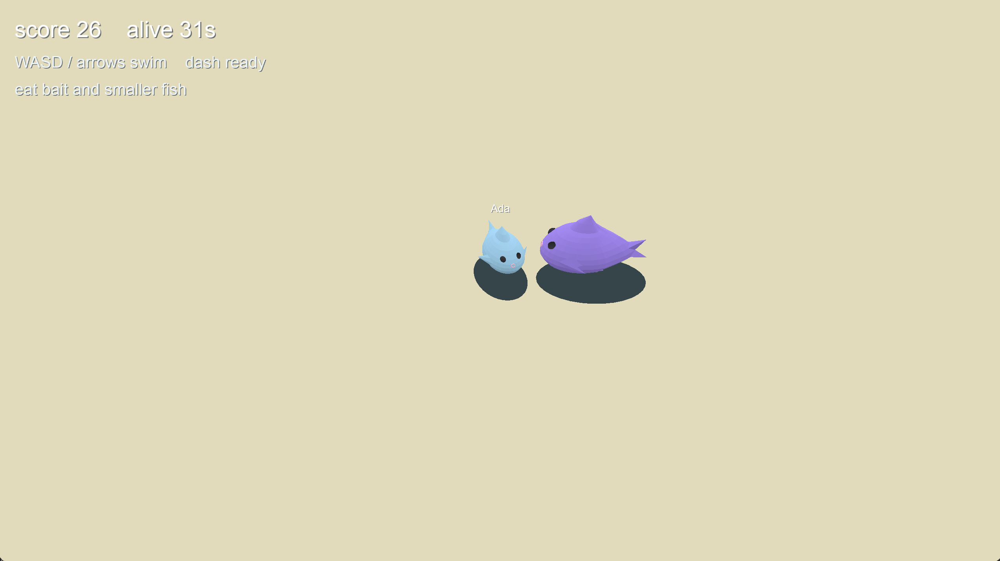

# Big fish eat small fish

Author: Shuning Liu

Design: Swim a fish through a shared sea. Eat anything clearly smaller than you to grow, and stay away from anything bigger — other players included. The bigger you get, the slower you swim, so the top of the food chain is a target.

Networking: Authoritative server. On connect, each client sends one `C2S_Join` (name and RGB) via `Player::send_join_message`. After that it sends `C2S_Controls` (WASD / arrows and dash) from `PlayMode::update`. The server (`server.cpp`) applies the join to that player's fish, then steps `Game::update` at 30 Hz: it drives players and NPC fish, resolves who eats whom, respawns the eaten, and broadcasts `S2C_State`. The receiving client is always the first player in that list.

Screen Shot:

How To Play:

Start `dist/server <port>`, then one client per player: `dist/client <host> <port> <name> <r> <g> <b>`. Color channels are 0-255. Example: `dist/client localhost 12345 Ada 80 180 255`.
Swim with WASD or the arrow keys. Space is a short dash. Try to live longer and gain more score.

Sources: Built on the 15-466 base code and its bundled libraries. Scene and fish models are authored in Blender (`meshes/sea.blend`, `meshes/fish.blend`) and exported to `.pnct` / `.scene` for the game. HUD text uses the bundled Original Surfer font (`fonts/Original_Surfer/`, SIL OFL).

This game was built with [NEST](NEST.md).
